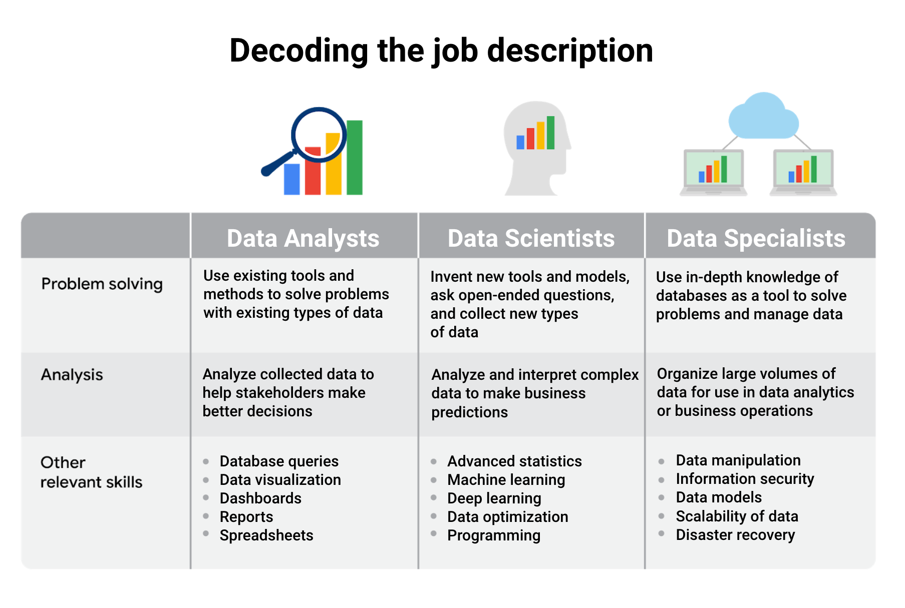

# Course 1 : Foundations: Data, Data, Everywhere

This document covers the notes from the Google Data Analytics course - Course 1

## Module 1

- Businesses need a way to control all that data so they can use it to improve processes, identify opportunities and trends, launch new products, serve customers, and make thoughtful decisions.
- The more detailed definition is that data analysis is the collection, transformation, and organization of data in order to draw conclusions, make predictions, and drive informed decision-making.

### The six steps/phases of the data analysis process

These six steps apply to any data analysis.

1. `ask`: business challenge, objective, or question
   - In the `ask phase`, you’ll work to understand the challenge to be solved or the question to be answered.
   - It will likely be assigned to you by stakeholders.
   - As this is the `ask phase`, you’ll ask many questions to help you along the way.
2. `prepare`: data generation, collection, storage, and data management
   - In the `prepare phase` you’ll find and collect the data you'll need to answer your questions.
   - You’ll identify data sources, gather data, and verify that it is accurate and useful for answering your questions.
3. `process`: data cleaning and data integrity
   - The `process phase` is when you will clean and organize your data.
   - Tasks you perform here include removing any inconsistencies, filling in missing values; and, in many cases, changing the data to a format that's easier to work with.
   - Essentially, you’re ensuring the data is ready before you begin analysis.
4. `analyze`: data exploration, visualization, and analysis
   - The `analyze phase` is when you do the necessary data analysis to uncover answers and solutions.
   - Depending on the situation and the data, this could involve tasks such as calculating averages or counting items in categories so you can examine trends and patterns.
5. `share`: communicating and interpreting results
   - The `share phase` is when you present your findings to decision-makers through a report, presentation, or data visualization.
   - As part of the `share phase`, you decide which medium you want to use to share your findings and select the data to include.
   - Tools for presenting data visually include charts made in Google Sheets, Tableau, and R.
6. `act`: putting insights to work to solve the problem
   - Last is the `act phase`, in which you and others in the company put the data insights into action.
   - This could mean implementing a new business strategy, making changes to a website, or any other action that solves the initial problem.

> [!TIP]
> Additional reference - [“4 Examples of Business Analytics in Action”](https://online.hbs.edu/blog/post/business-analytics-examples)

### Types of Data Analytics

- EMC Corporation's (now Dell EMC) `Cyclical` data analytics process has six steps:
  - Discovery
  - Pre-processing data
  - Model planning
  - Model building
  - Communicate results
  - Operationalize
- SAS's `iterative` process
  - Ask
  - Prepare
  - Explore
  - Model
  - Implement
  - Act
  - Evaluate
- A `project-based` data analytics process has five simple steps:
  - Identifying the problem
  - Designing data requirements
  - Pre-processing data
  - Performing data analysis
  - Visualizing data
- `Big data analytics` process
  - Business case evaluation
  - Data identification
  - Data acquisition and filtering
  - Data extraction
  - Data validation and cleaning
  - Data aggregation and representation
  - Data analysis
  - Data visualization
  - Utilization of analysis results

### The five essential skills of a data analyst

- `Curiosity`: all about wanting to learn something.
- `Understanding context`: the condition in which something exists or happens.
- Having a `technical mindset`: the ability to break things down into smaller steps or pieces and work with them in an orderly and logical way.
- `Data design`: how you organize information.
- `Data strategy`: management of the people, processes, and tools used in data analysis.

### `Analytical Thinking`

The five key aspects of analytical thinking are:

- `visualization`: In data analytics, visualization is the graphical representation of information.
- `strategy`: is key to staying focused and on track. Strategizing helps data analysts see what they want to achieve with the data and how they can get there.
- `problem-orientation`: approach used to identify, describe, and solve problems.
- `correlation`: is like a relationship. You can find all kinds of correlations in data.

> [!TIP]
> Correlation does not equal causation. In other words, just because two pieces of data are both trending in the same direction, that doesn't necessarily mean they are all related.

- `big-picture and detail-oriented thinking`: means being able to see the big picture as well as the details.

### Module 1 Glossary

- `Analytical skills`: Qualities and characteristics associated with using facts to solve problems
- `Analytical thinking`: The process of identifying and defining a problem, then solving it by using data in an organized, step-by-step manner
- `Context`: The condition in which something exists or happens
- `Data`: A collection of facts
- `Data analysis`: The collection, transformation, and organization of data in order to draw conclusions, make predictions, and drive informed decision-making
- `Data analyst`: Someone who collects, transforms and organizes data in order to draw conclusions, make predictions, and drive informed decision-making
- `Data analytics`: The science of data
- `Data design`: How information is organized
- `Data-driven decision-making`: Using facts to guide business strategy
- `Data ecosystem`: The various elements that interact with one another in order to produce, manage, store, organize, analyze, and share data
- `Data science`: A field of study that uses raw data to create new ways of modeling and understanding the unknown
- `Data strategy`: The management of the people, processes, and tools used in data analysis
- `Data visualization` / `Visualization`: The graphical representation of data
- `Dataset`: A collection of data that can be manipulated or analyzed as one unit
- `Gap analysis`: A method for examining and evaluating the current state of a process in order to identify opportunities for improvement in the future
- `Root cause`: The reason why a problem occurs
- `Technical mindset`: The ability to break things down into smaller steps or pieces and work with them in an orderly and logical way

----

## Module 2

### Stages of Data Life Cycle

Following are the stages for data life cycle 
1. Plan: Decide what kind of data is needed, how it will be managed, and who will be responsible for it.
    - a business decides what kind of data it needs, how it will be managed throughout its life cycle, who will be responsible for it, and the optimal outcomes
2. Capture: Collect or bring in data from a variety of different sources.
    - data is collected from a variety of different sources and brought into the organization
3. Manage: Care for and maintain the data. This includes determining how and where it is stored and the tools used to do so.
    - how we care for our data, how and where it's stored, the tools used to keep it safe and secure, and the actions taken to make sure that it's maintained properly
4. Analyze: Use the data to solve problems, make decisions, and support business goals.
    - the data is used to solve problems, make great decisions, and support business goals
5. Archive: Keep relevant data stored for long-term and future reference.
    - archiving means storing data in a place where it's still available, but may not be used again
6. Destroy: Remove data from storage and delete any shared copies of the data.

> [!CAUTION]
> As a quick note, when you maintain a database of customer information, ensuring data integrity, credibility, and privacy are all important concerns. 

### Module 2 Glossary

- `Database`: A collection of data stored in a computer system
- `Formula`: A set of instructions used to perform a calculation using the data in a spreadsheet
- `Function`: A preset command that automatically performs a specified process or task using the data in a spreadsheet
- `Query`: A request for data or information from a database
- `Query language`: A computer programming language used to communicate with a database
- `Stakeholders`: People who invest time and resources into a project and are interested in its outcome
- `Structured Query Language` / `SQL`: A computer programming language used to communicate with a database
- `Spreadsheet`: A digital worksheet

----

## Module 3

- An `attribute` is a characteristic or quality of data used to label a column in a table.
- In a dataset, a row is also called an `observation`.
    - An `observation` includes all of the attributes for something contained in a row of a data table.

> [!NOTE]
> `Spreadsheets` and `SQL` are the most commonly used data analysis tools.

----

## Module 4

### Case Study - Chick-fil-A.

- Until the recent past they used to have 2 options to order food - 
  1. Order online and pickup in store (inside)
  2. Order online and pickup in drive-through.
  3. Order while in drive-through.
  4. Order a take out from inside the store (inside)
  5. Dine in
- The drive-through options should have been the fastest, but at times,s if you are stuck in a queue. it used to take more time to order in the drive-through - several minutes at times - just to place the order.
- They may have collected the order creation time for each order in the drive-through and may have noticed that some of the order were significantly quick while some others took longer. This implies that there are some consumers who know what they want before they arrive the restaurant (or they may even have an online order already placed and are just collecting), while some others are still exploring the options.
- Once they would have collected and visualized the insights on how long the drive-through orders take they may realize that it would benefit to bring in a system to split the queues to allow online order to bypass the usual drive-through queue.
- Mobile-Express (or something like that) was invented where once you place the order now, you just need to drive to the location and scan a QR code. Your order is in progress as soon as you scan the QR code - and for this they use a separate drive-through lane.
- This has certainly (visibly) reduced the queues significantly and must have helped consumers save a lot of time not having to wait

### Consider fairness

Fairness means ensuring your analysis doesn't create or reinforce bias. In other words, as a data analyst, you want to help create systems that are fair and inclusive to everyone. 

Following are some strategies that support fair analysis:

| Best practice | Explanation | Example |
| ------------- | ----------- | ------- |
| Consider all of the available data | Part of your job as a data analyst is to determine what data is going to be useful for your analysis. Often there will be data that isn’t relevant to what you’re focusing on or doesn’t seem to align with your expectations. But you can’t just ignore it; it’s critical to consider all of the available data so that your analysis reflects the truth and not just your own expectations. | A state’s Department of Transportation is interested in measuring traffic patterns on holidays. At first, they only include metrics related to traffic volumes and the fact that the days are holidays. But the data team realizes they failed to consider how weather on these holidays might also affect traffic volumes. Considering this additional data helps them gain more complete insights. |
| Identify surrounding factors | Context is key for you and your stakeholders to understand the final conclusions of any analysis. Similar to considering all of the data, you also must understand surrounding factors that could influence the insights you’re gaining. | A human resources department wants to better plan for employee vacation time in order to anticipate staffing needs. HR uses a list of national bank holidays as a key part of the data-gathering process. But they fail to consider important holidays that aren’t on the bank calendar, which introduces bias against employees who celebrate them. It also gives HR less useful results because bank holidays may not necessarily apply to their actual employee population. |
| Include self-reported data | Self-reporting is a data collection technique where participants provide information about themselves. Self-reported data can be a great way to introduce fairness in your data collection process. People bring conscious and unconscious bias to their observations about the world, including about other people. Using self-reporting methods to collect data can help avoid these observer biases. Additionally, separating self-reported data from other data you collect provides important context to your conclusions! | A data analyst is working on a project for a brick-and-mortar retailer. Their goal is to learn more about their customer base. This data analyst knows they need to consider fairness when they collect data; they decide to create a survey so that customers can self-report information about themselves. By doing that, they avoid bias that might be introduced with other demographic data collection methods. For example, if they had sales associates report their observations about customers, they might introduce any unconscious bias the employees had to the data. |
| Use oversampling effectively | When collecting data about a population, it’s important to be aware of the actual makeup of that population. Sometimes, oversampling can help you represent groups in that population that otherwise wouldn’t be represented fairly. Oversampling is the process of increasing the sample size of nondominant groups in a population. This can help you better represent them and address imbalanced datasets. | A fitness company is releasing new digital content for users of their equipment. They are interested in designing content that appeals to different users, knowing that different people may interact with their equipment in different ways. For example, part of their user-base is age 70 or older. In order to represent these users, they oversample them in their data. That way, decisions they make about their fitness content will be more inclusive. |
| Think about fairness from beginning to end | To ensure that your analysis and final conclusions are fair, be sure to consider fairness from the earliest stages of a project to when you act on the data insights. This means that data collection, cleaning, processing, and analysis are all performed with fairness in mind. | A data team kicks off a project by including fairness measures in their data-collection process. These measures include oversampling their population and using self-reported data. However, they fail to inform stakeholders about these measures during the presentation. As a result, stakeholders leave with skewed understandings of the data. Learning from this experience, they add key information about fairness considerations to future stakeholder presentations. |

> [!TIP]
> A `business task` is described as the problem or question a data analyst answers for a business.

### Decoding the job description

The data analyst role is one of many job titles that contain the word “analyst.” 

To name a few others that sound similar but may not be the same role:
- `Business analyst` — analyzes data to help businesses improve processes, products, or services
- `Data analytics consultant` — analyzes the systems and models for using data
- `Data engineer` — prepares and integrates data from different sources for analytical use
- `Data scientist` — uses expert skills in technology and social science to find trends through data analysis
- `Data specialist` — organizes or converts data for use in databases or software systems
- `Operations analyst` — analyzes data to assess the performance of business operations and workflows

### Module 4 Glossary

- `Business task`: The question or problem data analysis resolves for a business
- `Fairness`: A quality of data analysis that does not create or reinforce bias 
- `Oversampling`: The process of increasing the sample size of nondominant groups in a population. This can help you better represent them and address imbalanced datasets.
- `Self-reporting`: A data collection technique where participants provide information about themselves

## Glossary

- [Course 1 Glossary](https://docs.google.com/document/d/1FOolPbbNeiQ99x8YGtSAInyY-j2a1tKouFmfQ6vCaYg/template/preview?pli=1)
