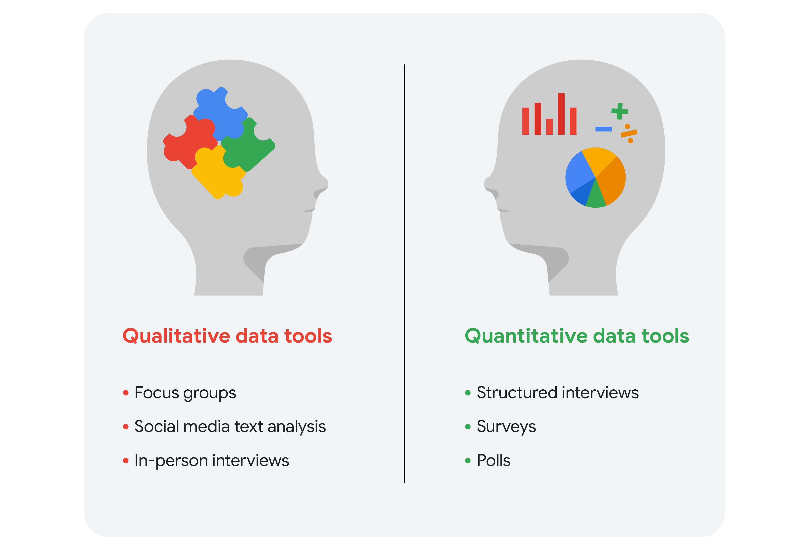

# Course 2 : Ask Questions to Make Data-Driven Decisions

This document covers the notes from the Google Data Analytics course - Course 2

## Module 1

### Type of problems encountered by Data Analyst

#### Making predictions 

A company that wants to know the best advertising method to bring in new customers is an example of a problem requiring analysts to make predictions. Analysts with data on location, type of media, and number of new customers acquired as a result of past ads can't guarantee future results, but they can help predict the best placement of advertising to reach the target audience.

#### Categorizing things 

An example of a problem requiring analysts to categorize things is a company's goal to improve customer satisfaction. Analysts might classify customer service calls based on certain keywords or scores. This could help identify top-performing customer service representatives or help correlate certain actions taken with higher customer satisfaction scores.

#### Spotting something unusual 

A company that sells smart watches that help people monitor their health would be interested in designing their software to spot something unusual. Analysts who have analyzed aggregated health data can help product developers determine the right algorithms to spot and set off alarms when certain data doesn't trend normally.

#### Identifying themes 

User experience (UX) designers might rely on analysts to analyze user interaction data. Similar to problems that require analysts to categorize things, usability improvement projects might require analysts to identify themes to help prioritize the right product features for improvement. Themes are most often used to help researchers explore certain aspects of data. In a user study, user beliefs, practices, and needs are examples of themes. 

> [!NOTE]
> difference between categorizing things and identifying themes - categorizing things involves assigning items to categories; identifying themes takes those categories a step further by grouping them into broader themes.

#### Discovering connections 

A third-party logistics company working with another company to get shipments delivered to customers on time is a problem requiring analysts to discover connections. By analyzing the wait times at shipping hubs, analysts can determine the appropriate schedule changes to increase the number of on-time deliveries. 

#### Finding patterns

Minimizing downtime caused by machine failure is an example of a problem requiring analysts to find patterns in data. For example, by analyzing maintenance data, they might discover that most failures happen if regular maintenance is delayed by more than a 15-day window. 

### SMART Questions

- `Leading Questions`: Questions that lead the conversation or guide the conversation in a specific direction.
- SMART Questions: **S**pecific, **M**easurable, **A**ction-oriented, **R**elevant, and **T**ime-bound.
  - **Specific** questions are simple, significant and focused on a single topic or a few closely related ideas.
  - **Measurable** questions are questions that can be quantified and accessed.
  - **Action-oriented** questions are questions that are designed to lead to action.
  - **Relevant** matter, are important and have significance to the problem you're trying to solve.
  - **Time-bound** questions specify the time period of interest.

### Module 1 Glossary 

- `Action-oriented question`: A question whose answers lead to change
- `Cloud`: A place to keep data online, rather than a computer hard drive
- `Data analysis process`: The six phases of ask, prepare, process, analyze, share, and act whose purpose is to gain insights that drive informed decision-making
- `Data life cycle`: The sequence of stages that data experiences, which include plan, capture, manage, analyze, archive, and destroy
- `Leading question`: A question that steers people toward a certain response
- `Measurable question`: A question whose answers can be quantified and assessed
- `Problem types`: The various problems that data analysts encounter, including categorizing things, discovering connections, finding patterns, identifying themes, making predictions, and spotting something unusual
- `Relevant question`: A question that has significance to the problem to be solved
- `SMART methodology`: A tool for determining a question’s effectiveness based on whether it is specific, measurable, action-oriented, relevant, and time-bound 
- `Specific question`: A question that is simple, significant, and focused on a single topic or a few closely related ideas
- `Structured thinking`: The process of recognizing the current problem or situation, organizing available information, revealing gaps and opportunities, and identifying options 
- `Time-bound question`: A question that specifies a time-frame to be studied
- `Unfair question`: A question that makes assumptions or is difficult to answer honestly 

## Module 2

### Data-driven decisions
- Data-driven decision-making means using facts to guide business strategy.
- The phrase “data-driven decisions” means exactly that: Data is used to arrive at a decision.
- This approach is limited by the quantity and quality of readily-available data.
  - If the quality and quantity of the data is sufficient, this approach can far improve decision-making.
  - But if the data is insufficient or biased, this can create problems for decision-makers.
- Potential dangers of relying entirely on data-driven decision-making can include - 
  - over reliance on historical data
  - tendency to ignore qualitative insights
  - potential biases in data collection and analysis

**Example of a data-driven decision**
A/B testing is a simple example of collecting data for data-driven decision-making. For example, a website that sells widgets has an idea for a new website layout they think will result in more people buying widgets. For two weeks, half of their website visitors are directed to the old site; the other half are directed to the new site. After those two weeks, the analyst gathers the data about their website visitors and the number of widgets sold for analysis. This helps the analyst understand which website layout resulted in more widget sales. If the new website performed better in producing widget sales, then the company can confidently make the decision to use the new layout!

### Data-inspired decisions
- Data-inspired decisions include the same considerations as data-driven decisions while adding another layer of complexity.
- They create space for people using data to consider a broader range of ideas: drawing on comparisons to related concepts, giving weight to feelings and experiences, and considering other qualities that may be more difficult to measure.
- Data-inspired decision-making can avoid some of the pitfalls that data-driven decisions might be prone to. 

**Example of a data-inspired decision**
A customer support center gathers customer satisfaction data (often known as a “CSAT” score). They use a simple 1–10 score along with a qualitative description in which the customer describes their experience. The customer support center manager wants to improve customer experience, so they set a goal to improve the CSAT score. They start by analyzing the CSAT scores and reading each of the descriptions from the customers. Additionally, they interview the people working in the customer support center. From there, the manager formulates a strategy and decides what needs to improve the most in order to raise customer satisfaction scores. While the manager certainly relies on the CSAT data in the decision-making process, input of support center representatives and other qualitative information informs the approach as well.

### Qualitative and Quantitative data

- `Quantitative data` is all about the specific and objective measures of numerical facts.
  - This can often be the what, how many, and how often about a problem.
  - In other words, things you can measure, like how many commuters take the train to work every week.
- `Qualitative data` describes subjective or explanatory measures of qualities and characteristics or things that can't be measured with numerical data.
  - Qualitative data is great for helping us answer why questions.
  - For example, why people might like a certain celebrity or snack food more than others.
  - With quantitative data, we can see numbers visualized as charts or graphs.
  - Qualitative data can then give us a more high-level understanding of why the numbers are the way they are. This is important because it helps us add context to a problem.

### Sharing data - Reports and Dashboards

#### Reports

- A report is a static collection of data given to stakeholders periodically.
- **Pros**
  - Reports are great for giving snapshots of high level historical data for an organization.
  - They can be designed and sent out periodically, often on a weekly or monthly basis, as organized and easy to reference information.
  - They're quick to design and easy to use as long as you continually maintain them.
  - Finally, because reports use static data or data that doesn't change once it's been recorded, they reflect data that's already been cleaned and sorted.
- **Cons**
  - Reports need regular maintenance and aren't very visually appealing.
  - Reports don't show live, evolving data.

#### Dashboards

- A dashboard monitors live, incoming data.
- **Pros**
  - Dashboards are great for a lot of reasons, they give your team more access to information being recorded, you can interact through data by playing with filters, and because they're dynamic, they have long-term value.
  - If stakeholders need to continually access information, a dashboard can be more efficient than having to pull reports over and over, which is a big time saver for you.
  - They're just nice to look at.
  - Easy access for stakeholders
  - Ability to monitor live data
  - Low maintenance
- **Cons**
  - They take a lot of time to design and can actually be less efficient than reports, if they're not used very often.
  - If the base table breaks at any point, they need a lot of maintenance to get back up and running again.
  - Dashboards can sometimes overwhelm people with information too.

##### Dashboard benefits
The following table summarizes the benefits of using a dashboard for both data analysts and their stakeholders.

| Benefits | For data analysts | For stakeholders |
| --- | --- | --- |
| Centralization | Share a single source of data with all stakeholders | Work with a comprehensive view of data, initiatives, objectives, projects, processes, and more |
| Visualization | Show and update live, incoming data in real time* | Spot changing trends and patterns more quickly |
| Insightfulness | Pull relevant information from different datasets | Understand the story behind the numbers to keep track of goals and make data-driven decisions |
| Customization | Create custom views dedicated to a specific person, project, or presentation of the data  Drill down to more specific areas of specialized interest or concern |

##### Create a dashboard
Here’s a process you can follow to create a dashboard, whether in Tableau or another visualization tool:

1. Identify the stakeholders who need to see the data and how they will use it
2. Design the dashboard (what should be displayed)
  1. Use a clear header to label the information.
  2. Add short text descriptions to each visualization.
  3. Show the most important information at the top.
3. Create mockups if desired
4. Select the visualizations

##### Types of dashboards

The three most common categories are:

###### Strategic

- Focuses on long term goals and strategies at the highest level of metrics
- They typically contain information that is useful for enterprise-wide decision-making.

###### Operational

- short-term performance tracking and intermediate goals.
- contain information on a time scale of days, weeks, or months.
- they can provide performance insight almost in real-time. 
- This allows businesses to track and maintain their immediate operational processes in light of their strategic goals.

###### Analytical

- consists of the datasets and the mathematics used in these sets
- contain a vast amount of data used by data analysts.
- contain the details involved in the usage, analysis, and predictions made by data scientists.

### Data v/a Metrics

- `Data` is a collection of facts.
- `Metrics` are a single, quantifiable type of data that can be used for measurement.
  - Metrics can also be combined into formulas that you can plug your numerical data into.
  - Data contains a lot of raw details about the problem we're exploring.
  - But the right metrics provide the answers we're looking for.

> [!NOTE]
> The metric goal is a measurable goal set by a company and evaluated using metrics.

### Big and Small Data

- `Small data` can be really small.
  - These kinds of data tend to be made up of datasets concerned with specific metrics over a short, well defined period of time.
  - Small data can be useful for making day-to-day decisions, like deciding to drink more water.
    - But it doesn't have a huge impact on bigger frameworks like business operations. 
- `Big data` has larger, less specific datasets covering a longer period of time.
  - They usually have to be broken down to be analyzed.
  - Big data is useful for looking at large-scale questions and problems, and they help companies make big decisions.

> [!NOTE]
> 4 V words for big data while considering the benefits and challenges of data - 
> | V           | Description                             |
> | ----        | ----                                    |
> | `Volume`    | he amount of data                       |
> | `Variety`   | The different kinds of data             |
> | `Velocity`  | How fast the data can be processed      |
> | `Veracity`  | The quality and reliability of the data |

### Module 2 Glossary

- `Algorithm`: A process or set of rules followed for a specific task
- `Big data`: Large, complex datasets typically involving long periods of time, which enable data analysts to address far-reaching business problems
- `Dashboard`: A tool that monitors live, incoming data
- `Data-inspired decision-making`: The process of exploring different data sources to find out what they have in common
- `Metric`: A single, quantifiable type of data that is used for measurement
- `Metric goal`: A measurable goal set by a company and evaluated using metrics
- `Pivot chart`: A chart created from the fields in a pivot table
- `Pivot table`: A data summarization tool used to sort, reorganize, group, count, total, or average data
- `Problem types`: The various problems that data analysts encounter, including categorizing things, discovering connections, finding patterns, identifying themes, making predictions, and spotting something unusual
- `Qualitative data`: A subjective and explanatory measure of a quality or characteristic
- `Quantitative data`: A specific and objective measure, such as a number, quantity, or range
- `Report`: A static collection of data periodically given to stakeholders
- `Return on investment (ROI)`: A formula that uses the metrics of investment and profit to evaluate the success of an investment
- `Revenue`: The total amount of income generated by the sale of goods or services
- `Small data`: Small, specific data points typically involving a short period of time, which are useful for making day-to-day decisions

## Module 3

### Spreadsheet Formulas

- `Formulas` are built on `operators` which are symbols that name the type of operation or calculation to be performed.
  - For example, a plus sign is a common operator. The formulas you use as a data analyst will usually include at least one operator.
- A `cell reference` is a single cell or range of cells in a worksheet that can be used in a formula.
  - Cell references contain the letter of the column and the number of the row where the data is.
  - A range of cells is a collection of two or more cells. 
- `Absolute referencing` is marked by a dollar sign ($). For example, `=$A$10` has absolute referencing for both the column and the row value.
  - `Absolute references` will <ins>not</ins> change when you copy and paste the formula in a different cell. The cell being referenced is always the same.
- `Relative references` (which is what you normally do, e.g. `=A10`) will change anytime the formula is copied and pasted. They are in relation to where the referenced cell is located.
- `Combining with functions`
  - `COUNTIF()` is a formula and a function.
  - This means the function runs based on criteria set by the formula.
  - In this case, `COUNT` is the formula; it will be executed `IF` the conditions you create are true.

#### Errors

| Error | Description | Example |
| --- | --- | --- |
| `#DIV/0!` | A formula is trying to divide a value in a cell by 0 (or an empty cell with no value) | `=B2/B3`, when the cell `B3` contains the value `0` |
| `#ERROR!` | (Google Sheets)  Something can’t be interpreted as it has been input. This is also known as a parsing error. | `=COUNT(B1:D1 C1:C10)` is invalid because the cell ranges aren't separated by a comma |
| `#NULL!` | (MS Excel)  Something can’t be interpreted as it has been input. This is also known as a parsing error. | `=COUNT(B1:D1 C1:C10)` is invalid because the cell ranges aren't separated by a comma |
| `#N/A` | A formula can't find the data | The cell being referenced can't be found |
| `#NAME?` | The name of a formula or function used isn't recognized | The name of a function is misspelled |
| `#NUM!` | The spreadsheet can't perform a formula calculation because a cell has an invalid numeric value | `=DATEDIF(A4, B4, "M")` is unable to calculate the number of months between two dates because the date in cell A4 falls after the date in cell B4 |
| `#REF!` | A formula is referencing a cell that isn't valid | A cell used in a formula was in a column that was deleted |
| `#VALUE!` | A general error indicating a problem with a formula or with referenced cells | There could be problems with spaces or text, or with referenced cells in a formula; you may have additional work to find the source of the problem. |

> [!TIP]
> `Conditional formatting` can be used to highlight cells a different color based on their contents.
> This feature can be extremely helpful when you want to locate all errors in a large spreadsheet.
> Use `=ISERROR(A1)` for this.

### Spreadsheet Functions

- A `function` is a preset command that automatically performs a specific process or task using the data.
- All functions with an equal sign; for example `=SUM`.

#### Difference between formulas and functions
- A `formula` is a set of instructions used to perform a calculation using the data in a spreadsheet.
- A `function` is a preset command that automatically performs a specific process or task using the data in a spreadsheet.

### Structured Thinking

- In the data world, a the `problem domain` is the specific area of analysis that encompasses every activity affecting or affected by the problem.
- `Structured thinking` is the process of `recognizing the current problem` or situation, `organizing available information`, `revealing gaps and opportunities`, and `identifying the options`.
  - In other words, it's a way of being super prepared. It's having a clear list of what you are expected to deliver, a timeline for major tasks and activities, and checkpoints so the team knows you're making progress.
- A `scope of work` or `SOW` is an agreed upon outline of the work you're going to perform on a project. 
  - Scope of Work consists of the following - 
    - `Deliverables`: items or tasks to be completed before the project is finished.
      - What work is being done, and what things are being created as a result of this project?
      - When the project is complete, what are you expected to deliver to the stakeholders?
      - Will you collect data for this project? How much, or for how long?
      - Avoid vague statements. 
    - `Timeline`: include due dates for when deliverables, milestones, and/or reports are due.
      - Your timeline will be closely tied to the milestones you create for your project.
      - The timeline is a way of mapping expectations for how long each step of the process should take.
      - The timeline should be specific enough to help all involved decide if a project is on schedule.
      - When will the deliverables be completed?
      - How long do you expect the project will take to complete?
      - If all goes as planned, how long do you expect each component of the project will take?
      - When can we expect to reach each milestone?
    - `Milestones`:  significant tasks that help you confirm along your timeline to help everyone know the project is on track.
      - What are the major milestones for progress in your project?
      - How do you know when a given part of the project is considered complete? 
      - Milestones can be identified by you, by stakeholders, or by other team members such as the Project Manager.
    - `Reports`: notify everyone as you finalize deliverables and meet milestones.
      - Set boundaries for how and when you’ll give status updates to stakeholders.
      - How will you communicate progress with stakeholders and sponsors, and how often?
      - Will progress be reported weekly? Monthly?
      - When milestones are completed?
      - What information will status reports contain?

> [!CAUTION]
> SOWs should also contain information specific to what is and isn’t considered part of the project. 

### Contextualizing Data / Staying Objective

- `Context` in data analytics is the condition and circumstances that surround and give meaning to the data.
  - `Context` is important in data analytics because it helps make disorganized data accessible and understood.
  - The fact is, data has little value if it is not paired with context. 
  - `Context` can turn raw data into meaningful information.
  - It is very important for data analysts to contextualize their data. This means giving the data perspective by defining it. To do this, you need to identify:
    - `Who`: The person or organization that created, collected, and/or funded the data collection
    - `What`: The things in the world that data could have an impact on
    - `Where`: The origin of the data
    - `When`: The time when the data was created or collected
    - `Why`: The motivation behind the creation or collection
    - `How`: The method used to create or collect it

> [!NOTE]
> To ensure accurate and fair data, ensure an accurate representation of the population, collect data in an impartial manager, and consider different viewpoints before drawing conclusions. Asking about the “who, what, where, when, how, and why" of the data also adds important context.

### Module 3 Glossary

- `AVERAGE`: A spreadsheet function that returns an average of the values from a selected range
- `Borders`: Lines that can be added around two or more cells on a spreadsheet
- `Cell reference`: A cell or a range of cells in a worksheet typically used in formulas and functions
- `COUNT`: A spreadsheet function that counts the number of cells in a range that meet a specific criteria
- `Equation`: A calculation that involves addition, subtraction, multiplication, or division (also called a math expression)
- `Fill handle`: A box in the lower-right-hand corner of a selected spreadsheet cell that can be dragged through neighboring cells in order to continue an instruction
- `Filtering`: The process of showing only the data that meets a specified criteria while hiding the rest
- `Header`: The first row in a spreadsheet that labels the type of data in each column
- `Math expression`: A calculation that involves addition, subtraction, multiplication, or division (also called an equation)
- `Math function`: A function that is used as part of a mathematical formula
- `MAX`: A spreadsheet function that returns the largest numeric value from a range of cells
- `MIN`: A spreadsheet function that returns the smallest numeric value from a range of cells
- `Open data`: Data that is available to the public
- `Operator`: A symbol that names the operation or calculation to be performed
- `Order of operations`: Using parentheses to group together spreadsheet values in order to clarify the order in which operations should be performed
- `Problem domain`: The area of analysis that encompasses every activity affecting or affected by a problem
- `Range`: A collection of two or more cells in a spreadsheet
- `Report`: A static collection of data periodically given to stakeholders
- `Return on investment (ROI)`: A formula that uses the metrics of investment and profit to evaluate the success of an investment
- `Revenue`: The total amount of income generated by the sale of goods or services
- `Scope of work (SOW)`: An agreed-upon outline of the tasks to be performed during a project
- `Sorting`: The process of arranging data into a meaningful order to make it easier to understand, analyze, and visualize
- `SUM`: A spreadsheet function that adds the values of a selected range of cells

## Module 4

### Balance team and stakeholders needs

By definition, stakeholders are people who have invested time, interest, and resources into the project.

#### Types of stakeholders

##### Executive team

- The executive team provides strategic and operational leadership to the company.
- They set goals, develop strategy, and make sure that strategy is executed effectively.
- The executive team might include vice presidents, the chief marketing officer, and senior-level professionals who help plan and direct the company’s work.
- These stakeholders think about decisions at a very high level and they are looking for the headline news about your project first.
- They are less interested in the details.

##### Customer-facing team

- The customer-facing team includes anyone in an organization who has some level of interaction with customers and potential customers.
- Typically they compile information, set expectations, and communicate customer feedback to other parts of the internal organization.
- These stakeholders have their own objectives and may come to you with specific asks.
- It is important to let the data tell the story and not be swayed by asks from your stakeholders to find certain patterns that might not exist. 

#### Data science team

#### Working with stakeholders

- `Discuss goals`
  - Stakeholder requests are often tied to a bigger project or goal.
  - When they ask you for something, take the opportunity to learn more.
  - Start a discussion. Ask about the kind of results the stakeholder wants.
- `Feel empowered to say “no.”`
  - Stakeholders don’t always realize the time and effort that goes into collecting and analyzing data.
  - They also might not know what they actually need.
  - You can help stakeholders by asking about their goals and determining whether you can deliver what they need. If you can’t, have the confidence to say “no,” and provide a respectful explanation.
- `Plan for the unexpected`
  - Before you start a project, make a list of potential roadblocks.
  - Then, when you discuss project expectations and timelines with your stakeholders, give yourself some extra time for problem-solving at each stage of the process.
- `Know your project`
  - Keep track of your discussions about the project over email or reports, and be ready to answer questions about how certain aspects are important for your organization.
- `Start with words and visuals`
  - It is common for data analysts and stakeholders to interpret things in different ways while assuming the other is on the same page.
  - This illusion of agreement* has been historically identified as a cause of projects going back-and-forth a number of times before a direction is finally nailed down.
  - To help avoid this, start with a description and a quick visual of what you are trying to convey.
  - Stakeholders have many points of view and may prefer to absorb information in words or pictures.
  - Work with them to make changes and improvements from there.
  - The faster everyone agrees, the faster you can perform the first analysis to test the usefulness of the project, measure the feedback, learn from the data, and implement changes.
- `Communicate often`
  - Share notes about project milestones, setbacks, and changes.
  - Then use your notes to create a shareable report.
  - Another great resource to use is a change-log, which is a tool that will be explored further throughout the program.
    - `Change-log` is a file containing a chronologically ordered list of modifications made to a project.
    - Depending on the way you set it up, stakeholders can even pop in and view updates whenever they want.

> [!TIP]
> Balancing everyone's needs can be a little chaotic sometimes. There are three things you can focus on that will help you stay on task.
> 1. Who are the primary and secondary stakeholders?
> 2. Who is managing the data?
> 3. Where can you go for help? 

### Communication

> [!NOTE]
> Before putting together a presentation or sending an e-mail, think about - 
>   - Who your audience is?
>   - What they already know?
>   - What they need to know?
>   - How you can communicate that effectively to them?

> [!TIP]
> 

### Teamwork

Meeting Dos - 
- Come prepared
- Be on time
- Pay attention
- Ask questions

#### Conflict resolution

- Reframe the problem
- Discuss the conflict and context

### Module 4 Glossary

- `Cloud`: A place to keep data online, rather than a computer hard drive
- `Reframing`: Restating a problem or challenge, then redirecting it toward a potential resolution
- `Turnover rate`: The rate at which employees voluntarily leave a company

## Course 2 Glossary

[Course 2 Glossary](https://docs.google.com/document/d/1Vc_0kdX0NbhvxJufJUY98T1XiOA9syuHqi5w6tpmuGA/template/preview)

- `Action-oriented question`: A question whose answers lead to change
- `Algorithm`: A process or set of rules followed for a specific task
- `AVERAGE`: A spreadsheet function that returns an average of the values from a selected range
- `Big data`: Large, complex datasets typically involving long periods of time, which enable data analysts to address far-reaching business problems
- `Borders`: Lines that can be added around two or more cells on a spreadsheet
- `Cell reference`: A cell or a range of cells in a worksheet typically used in formulas and functions
- `Cloud`: A place to keep data online, rather than a computer hard drive
- `COUNT`: A spreadsheet function that counts the number of cells in a range that meet a specific criteria
- `Dashboard`: A tool that monitors live, incoming data
- `Data analysis process`: The six phases of ask, prepare, process, analyze, share, and act whose purpose is to gain insights that drive informed decision-making
- `Data-inspired decision-making`: The process of exploring different data sources to find out what they have in common
- `Data life cycle`: The sequence of stages that data experiences, which include plan, capture, manage, analyze, archive, and destroy
- `Equation`: A calculation that involves addition, subtraction, multiplication, or division (also called a math expression)
- `Fill handle`: A box in the lower-right-hand corner of a selected spreadsheet cell that can be dragged through neighboring cells in order to continue an instruction
- `Filtering`: The process of showing only the data that meets a specified criteria while hiding the rest
- `Header`: The first row in a spreadsheet that labels the type of data in each column
- `Leading question`: A question that steers people toward a certain response
- `Math expression`: A calculation that involves addition, subtraction, multiplication, or division (also called an equation)
- `Math function`: A function that is used as part of a mathematical formula
- `MAX`: A spreadsheet function that returns the largest numeric value from a range of cells
- `Measurable question`: A question whose answers can be quantified and assessed
- `Metric`: A single, quantifiable type of data that is used for measurement
- `Metric goal`: A measurable goal set by a company and evaluated using metrics
- `MIN`: A spreadsheet function that returns the smallest numeric value from a range of cells
- `Open data`: Data that is available to the public
- `Operator`: A symbol that names the operation or calculation to be performed
- `Order of operations`: Using parentheses to group together spreadsheet values in order to clarify the order in which operations should be performed
- `Pivot chart`: A chart created from the fields in a pivot table 
- `Pivot table`: A data summarization tool used to sort, reorganize, group, count, total, or average data
- `Problem domain`: The area of analysis that encompasses every activity affecting or affected by a problem
- `Problem types`: The various problems that data analysts encounter, including categorizing things, discovering connections, finding patterns, identifying themes, making predictions, and spotting something unusual
- `Qualitative data`: A subjective and explanatory measure of a quality or characteristic
- `Quantitative data`: A specific and objective measure, such as a number, quantity, or range
- `Range`: A collection of two or more cells in a spreadsheet
- `Reframing`: Restating a problem or challenge, then redirecting it toward a potential resolution
- `Relevant question`: A question that has significance to the problem to be solved
- `Report`: A static collection of data periodically given to stakeholders
- `Return on investment (ROI)`: A formula that uses the metrics of investment and profit to evaluate the success of an investment
- `Revenue`: The total amount of income generated by the sale of goods or services
- `Scope of work (SOW)`: An agreed-upon outline of the tasks to be performed during a project
- `Small data`: Small, specific data points typically involving a short period of time, which are useful for making day-to-day decisions
- `SMART methodology`: A tool for determining a question’s effectiveness based on whether it is specific, measurable, action-oriented, relevant, and time-bound
- `Sorting`: The process of arranging data into a meaningful order to make it easier to understand, analyze, and visualize
- `Specific question`: A question that is simple, significant, and focused on a single topic or a few closely related ideas
- `Structured thinking`: The process of recognizing the current problem or situation, organizing available information, revealing gaps and opportunities, and identifying options
- `SUM`: A spreadsheet function that adds the values of a selected range of cells
- `Time-bound question`: A question that specifies a time frame to be studied
- `Turnover rate`: The rate at which employees voluntarily leave a company
- `Unfair question`: A question that makes assumptions or is difficult to answer honestly
