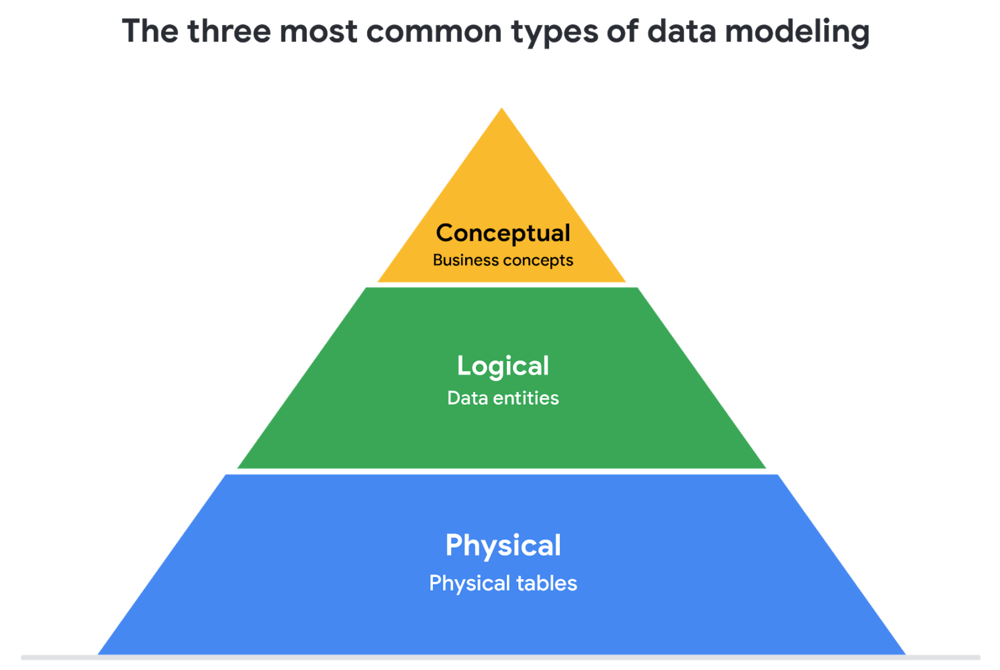

# Course 3 : Prepare Data for Exploration

This document covers the notes from the Google Data Analytics course - Course 3

## Module 1: Data types and structures

**How data is collected?**
- Interviews
- Observations
- Forms
- Questionnaire
- Surveys

**Types of data sources**
- `First-party`: Data collected directly.
- `Second-party`: Second-party data is collected directly by another group and then sold.
- `Third-party`: Third-party data is sold by a provider that didn’t collect the data themselves. Third-party data might come from a number of different sources.

**Data collection considerations**

### Data Formats

#### Primary versus secondary data

<table>
  <tr>
    <th>Data format classification</th>
    <th>Definition</th>
    <th>Examples</th>
  </tr>
  <tr>
    <td>Primary data</td>
    <td>Collected by a researcher from first-hand sources</td>
    <td>
      <ul>
        <li>Data from an interview you conducted - Data from a survey returned from 20 participants</li>
        <li>Data from questionnaires you got back from a group of workers</li>
      </ul>
    </td>
  </tr>
  <tr>
    <td>Secondary data</td>
    <td>Gathered by other people or from other research</td>
    <td>
      <ul>
        <li>Data you bought from a local data analytics firm’s customer profiles</li>
        <li>Demographic data collected by a university</li>
        <li>Census data gathered by the federal government</li>
      </ul>
    </td>
  </tr>
</table>

#### Internal versus external data

<table>
  <tr>
    <th>Data format classification</th>
    <th>Definition</th>
    <th>Examples</th>
  </tr>
  <tr>
    <td>Internal data</td>
    <td>Data that is stored inside a company’s own systems</td>
    <td>
      <ul>
        <li>Wages of employees across different business units tracked by HR</li>
        <li>Sales data by store location</li>
        <li>Product inventory levels across distribution centers</li>
      </ul>
    </td>
  </tr>
  <tr>
    <td>External data</td>
    <td>Data that is stored outside of a company or organization</td>
    <td>
      <ul>
        <li>National average wages for the various positions throughout your organization</li>
        <li>Credit reports for customers of an auto dealership</li>
      </ul>
    </td>
  </tr>
</table>

#### Continuous versus discrete data

<table>
  <tr>
    <th>Data format classification</th>
    <th>Definition</th>
    <th>Examples</th>
  </tr>
  <tr>
    <td>Continuous</td>
    <td>Data that is measured and can have almost any numeric value</td>
    <td>
      <ul>
        <li>Height of kids in third grade classes (52.5 inches, 65.7 inches)</li>
        <li>Runtime markers in a video </li>
        <li>Temperature</li>
      </ul>
    </td>
  </tr>
  <tr>
    <td>Discrete</td>
    <td>Data that is counted and has a limited number of values</td>
    <td>
      <ul>
        <li>Number of people who visit a hospital on a daily basis (10, 20, 200)</li>
        <li>Maximum capacity allowed in a room</li>
        <li>Tickets sold in the current month</li>
      </ul>
    </td>
  </tr>
</table>

#### Qualitative versus quantitative data

<table>
  <tr>
  <th>Data format classification</th>
  <th>Definition</th>
  <th>Examples</th>
  </tr>
  <tr>
    <td>Quantitative</td>
    <td>A specific and objective measure, such as a number, quantity, or range</td>
    <td>
      <ul>
        <li>Percentage of board certified doctors who are women</li>
        <li>Population size of elephants in Africa</li>
        <li>Distance from Earth to Mars at a particular time</li>
      </ul>
    </td>
  </tr>
  <tr>
    <td>Qualitative</td>
    <td>A subjective and explanatory measure of a quality or characteristic</td>
    <td>
      <ul>
        <li>Favorite exercise activity</li>
        <li>Brand with best customer service</li>
        <li>Fashion preferences of young adults</li>
      </ul>
    </td>
  </tr>
</table>

#### Nominal versus ordinal data

<table>
  <tr>
    <th>Data format classification</th>
    <th>Definition</th>
    <th>Examples</th>
  </tr>
  <tr>
    <td>Nominal</td>
    <td>A type of qualitative data that is categorized without a set order</td>
    <td>
      <ul>
        <li>First time customer, returning customer, regular customer</li>
        <li>New job applicant, existing applicant, internal applicant</li>
        <li>New listing, reduced price listing, foreclosure</li>
      </ul>
    </td>
  </tr>
  <tr>
    <td>Ordinal</td>
    <td>A type of qualitative data with a set order or scale</td>
    <td>
      <ul>
        <li>Movie ratings (number of stars: 1 star, 2 stars, 3 stars)</li>
        <li>Ranked-choice voting selections (1st, 2nd, 3rd)</li>
        <li>Satisfaction level measured in a survey (satisfied, neutral, dissatisfied)</li>
      </ul>
    </td>
  </tr>
</table>

#### Structured versus unstructured data

<table>
  <tr>
    <th>Data format classification</th>
    <th>Definition</th>
    <th>Examples</th>
  </tr>
  <tr>
    <td>Structured data</td>
    <td>Data organized in a certain format, like rows and columns</td>
    <td>
      <ul>
        <li>Expense reports</li>
        <li>Tax returns</li>
        <li>Store inventory</li>
      </ul>
    </td>
  </tr>
  <tr>
    <td>Unstructured data</td>
    <td>Data that cannot be stored as columns and rows in a relational database.</td>
    <td>
      <ul>
        <li>Social media posts</li>
        <li>Emails</li>
        <li>Videos</li>
      </ul>
    </td>

##### Comparison of Structured and Unstructured data

<table>
  <tr>
    <th>Structured data</th>
    <th>Unstructured data</th>
  </tr>
  <tr>
    <td>
      <ul>
        <li>Defined data types</li>
        <li>Most often quantitative data</li>
        <li>Easy to organize</li>
        <li>Easy to search</li>
        <li>Easy to analyze</li>
        <li>Examples: Excel, Google Sheets, SQL, customer data, phone records, transaction history</li>
      </ul>
    </td>
    <td>
      <ul>
        <li>Varied data types</li>
        <li>Most often qualitative data</li>
        <li>Difficult to search</li>
        <li>Provides more freedom for analysis</li>
        <li>Stored in data lakes, data warehouses, and NoSQL databases</li>
        <li>Can't be put in rows and columns</li>
        <li>Examples: Text messages, social media comments, phone call transcriptions, various log files, images, audio, video</li>
      </ul>
    </td>
  </tr>
</table>

### Data Modelling

- `Data modeling` is the process of creating diagrams that visually represent how data is organized and structured.
  - These visual representations are called data models.
  - Data models are similar to a blueprint of a house; different users might have different data needs, but the data model gives them an understanding of the structure as a whole. 

#### Levels of data modeling

- `Conceptual data modeling` gives a high-level view of the data structure, such as how data interacts across an organization.
  - A conceptual data model doesn't contain technical details.
  -  For example, a conceptual data model may be used to define the business requirements for a new database. 
- `Logical data modeling` focuses on the technical details of a database such as relationships, attributes, and entities.
  - For example, a logical data model defines how individual records are uniquely identified in a database. But it doesn't spell out actual names of database tables.
- `Physical data modeling` depicts how a database operates.
  - A physical data model defines all entities and attributes used.
  - For example, it includes table names, column names, and data types for the database.

#### Data-modeling techniques

- Two common methods are the `Entity Relationship Diagram (ERD)` and the `Unified Modeling Language (UML)` diagram.
  - `ERD` diagrams are a visual way to understand the relationship between entities in the data model.
  - `UML` diagrams are very detailed diagrams that describe the structure of a system by showing the system's entities, attributes, operations, and their relationships.

> [!NOTE]
> A third common data modeling technique is the `Data Dictionary`.

### Wide and Long Data Sets

- `Wide data` is a dataset in which every data subject has a single row with multiple columns to hold the values of various attributes of the subject.
  - It is helpful for comparing specific attributes across different subjects.
- `Long data` is data in which each row represents one observation per subject, so each subject will be represented by multiple rows.
  - This data format is useful for comparing changes over time or making other comparisons across subjects.

<table>
  <tr>
    <th>Wide data is preferred when</th>
    <th>Long data is preferred when</th>
  </tr>
  <tr>
    <td>Creating tables and charts with a few variables about each subject</td>
    <td>Storing a lot of variables about each subject. For example, 60 years worth of interest rates for each bank</td>
  </tr>
    <tr>
    <td>Comparing straightforward line graphs</td>
    <td>Performing advanced statistical analysis or graphing</td>
  </tr>
</table>

### Data Transformation

- `Data transformation` is the process of changing the data’s format, structure, or values.
- `Data transformation` usually involves:
  - Adding, copying, or replicating data
  - Deleting fields or records
  - Standardizing the names of variables
  - Renaming, moving, or combining columns in a database
  - Joining one set of data with another
  - Saving a file in a different format.
    - For example, saving a spreadsheet as a comma separated values (.csv) file.

#### Why transform data?

Goals for data transformation might be: 
- `Data organization`: better organized data is easier to use
- `Data compatibility`: different applications or systems can then use the same data
- `Data migration`: data with matching formats can be moved from one system to another
- `Data merging`: data with the same organization can be merged together
- `Data enhancement`: data can be displayed with more detailed fields
- `Data comparison`: apples-to-apples comparisons of the data can then be made

> [!TIP]
> Ref: [Kaggle](https://www.kaggle.com/)

### Module 1 Glossary

- `Agenda`: A list of scheduled appointments
- `Audio file`: Digitized audio storage usually in an MP3, AAC, or other compressed format
- `Boolean data`: A data type with only two possible values, usually true or false
- `Continuous data`: Data that is measured and can have almost any numeric value
- `Cookie`: A small file stored on a computer that contains information about its users
- `Data element`: A piece of information in a dataset
- `Data model`: A tool for organizing data elements and how they relate to one another
- `Digital photo`: An electronic or computer-based image usually in BMP or JPG format
- `Discrete data`: Data that is counted and has a limited number of values
- `External data`: Data that lives, and is generated, outside of an organization
- `Field`: A single piece of information from a row or column of a spreadsheet; in a data table, typically a column in the table
- `First-party data`: Data collected by an individual or group using their own resources
- `Long data`: A dataset in which each row is one time point per subject, so each subject has data in multiple rows
- `Nominal data`: A type of qualitative data that is categorized without a set order
- `Ordinal data`: Qualitative data with a set order or scale
- `Ownership`: The aspect of data ethics that presumes individuals own the raw data they provide and have primary control over its usage, processing, and sharing
- `Pixel`: In digital imaging, a small area of illumination on a display screen that, when combined with other adjacent areas, forms a digital image
- `Population`: In data analytics, all possible data values in a dataset
- `Record`: A collection of related data in a data table, usually synonymous with row
- `Sample`: In data analytics, a segment of a population that is representative of the entire population
- `Second-party data`: Data collected by a group directly from its audience and then sold
- `Social media`: Websites and applications through which users create and share content or participate in social networking
- `String data type`: A sequence of characters and punctuation that contains textual information (Refer to Text data type)
- `Structured data`: Data organized in a certain format such as rows and columns
- `Text data type`: A sequence of characters and punctuation that contains textual information (also called string data type)
- `Unstructured data`: Data that is not organized in any easily identifiable manner
- `Video file`: A collection of images, audio files, and other data usually encoded in a compressed format such as MP4, MV4, MOV, AVI, or FLV
- `Wide data`: A dataset in which every data subject has a single row with multiple columns to hold the values of various attributes of the subject

## Module 2: Data responsibility

### Biased and unbiased data

- `Biased data`:
  - Data that is not representative of the population
  - An example is sampling bias.
- `Unbiased data`: 
  - Data that is representative of the population being measured
  
#### Types of biases

- `Sampling bias`: when a sample isn't representative of the population as a whole.
- `Observer bias`: sometimes referred to as `experimenter bias` or `research bias`. Basically, it's the tendency for different people to observe things differently.
- `Interpretation bias`: the tendency to always interpret ambiguous situations in a positive, or negative way. Interpretation bias, can lead to two people seeing or hearing the exact same thing, and interpreting it in a variety of different ways, because they have different backgrounds, and experiences.
- `Confirmation bias`: the tendency to search for, or interpret information in a way that confirms preexisting beliefs. Someone might be so eager to confirm a gut feeling, that they only notice things that support it, ignoring all other signals.

### Data Credibility - Identifying good data sources

- `ROCCC`
  - `R`: Reliable
    - Bad data is unreliable as it may be biased or inaccurate.
  - `O`: Original
    - It may not be able to track the source of data for bad data sources.
  - `C`: Comprehensive
  - `C`: Current
  - `C`: Cited
    - To determine if a data source is cited, ask the following questions
      - Who created this dataset?
      - When was this data last refreshed?
      - Is this dataset from a credible organization?

### Data ethics and privacy

- While an exact definition is still under discussion in philosophy, one practical view is that `ethics` refers to well-founded standards of right and wrong that prescribe what humans ought to do, usually in terms of rights, obligations, benefits to society, fairness or specific virtues.
- `Data ethics` refers to well-founded standards of right and wrong that dictate how data is collected, shared, and used.
- There are lots of different aspects of `data ethics` like:
  - `ownership`: This answers the question who owns data? 
  - `transaction transparency`: the idea that all data processing activities and algorithms should be completely explainable and understood by the individual who provides their data. This helps avoid bias.
  - `consent`: an individual's right to know explicit details about how and why their data will be used before agreeing to provide it. They should know answers to questions like - 
    - Why is the data being collected?
    - How will it be used?
    - How long will it be stored?
    - > The best way to give consent is probably a conversation between the person providing the data and the person requesting it. 
  - `currency`: Individuals should be aware of financial transactions resulting from the use of their personal data and the scale of these transactions.
    - If your data is helping to fund a company's efforts, you should know what those efforts are all about and be given the opportunity to opt out.
  - `privacy`: When talking about data, privacy means preserving a data subject's information and activity any time a data transaction occurs.
    - This is sometimes called `information privacy` or `data protection`.
    - It's all about access, use, and collection of data.
    - It also covers a person's legal right to their data.
    > - This means someone like you or me should have protection from unauthorized access to our private data, freedom from inappropriate use of our data, the right to inspect, update, or correct our data, ability to give consent to use our data, and legal right to access our data. 
    - Read [Data anonymization](./Course-03.md#data-anonymization)
  - `openness`: refers to free access, usage and sharing of data.
    - - Read [Open Data](./Course-03.md#open-data)

#### Data anonymization

> [!NOTE]
> Personally identifiable information, or PII, is information that can be used by itself or with other data to track down a person's identity. 

- `Data anonymization` is the process of protecting people's private or sensitive data by eliminating that kind of information.
- Typically, data anonymization involves blanking, hashing, or masking personal information, often by using fixed-length codes to represent data columns, or hiding data with altered values.

**What types of data should be anonymized?**
- Healthcare and financial data are two of the most sensitive types of data.
- These industries rely a lot on data anonymization techniques.
- Data in these two industries usually goes through de-identification, which is a process used to wipe data clean of all PII.
- Here is a list of data that is often anonymized:
  - Telephone numbers
  - Names
  - License plates and license numbers
  - Social security numbers
  - IP addresses
  - Medical records
  - Email addresses
  - Photographs
  - Account numbers

#### Open Data

- In data analytics, `open data` is part of data ethics, which has to do with using data ethically.
- Openness refers to free access, usage, and sharing of data.
- But for data to be considered open, it has to:
  - Be available and accessible to the public as a complete dataset
  - Be provided under terms that allow it to be reused and redistributed
  - Allow universal participation so that anyone can use, reuse, and redistribute the data
- > Data can only be considered open when it meets all three of these standards. 
- Benefits of `openness` / `open data` -
  - credible databases can be used more widely.
  - all of that good data can be leveraged, shared, and combined with other data.
- Some examples of open data sources are -
  - [U.S. government data site](https://www.data.gov/)
  - [U.S. Census Bureau](https://www.census.gov/data.html)
  - [Open Data Network](https://www.opendatanetwork.com/)
  - [Google Cloud Public Datasets](https://cloud.google.com/datasets)
  - [Dataset Search](https://datasetsearch.research.google.com/)

### Module 2 Glossary

- `Bad data source`: A data source that is not reliable, original, comprehensive, current, and cited (ROCCC)
- `Bias`: A conscious or subconscious preference in favor of or against a person, group of people, or thing
- `Confirmation bias`: The tendency to search for or interpret information in a way that confirms pre-existing beliefs
- `Consent`: The aspect of data ethics that presumes an individual’s right to know how and why their personal data will be used before agreeing to provide it
- `Cookie`: A small file stored on a computer that contains information about its users
- `Currency`: The aspect of data ethics that presumes individuals should be aware of financial transactions resulting from the use of their personal data and the scale of those transactions
- `Data anonymization`: The process of protecting people's private or sensitive data by eliminating identifying information
- `Data bias`: When a preference in favor of or against a person, group of people, or thing systematically skews data analysis results in a certain direction
- `Data ethics`: Well-founded standards of right and wrong that dictate how data is collected, shared, and used
- `Data interoperability`: A key factor leading to the successful use of open data among companies and governments
- `Data privacy`: Preserving a data subject’s information any time a data transaction occurs
- `Ethics`: Well-founded standards of right and wrong that prescribe what humans ought to do, usually in terms of rights, obligations, benefits to society, fairness, or specific virtues
- `Experimenter bias`: The tendency for different people to observe things differently (also called `observer bias`)
- `Fairness`: A quality of data analysis that does not create or reinforce bias
- `First-party data`: Data collected by an individual or group using their own resources
- `Good data source`: A data source that is reliable, original, comprehensive, current, and cited (ROCCC)
- `Interpretation bias`: The tendency to interpret ambiguous situations in a positive or negative way
- `Observer bias`: The tendency for different people to observe things differently (also called `experimenter bias`)
- `Open data`: Data that is available to the public
- `Openness`: The aspect of data ethics that promotes the free access, usage, and sharing of data
- `Sampling bias`: Over representing or under representing certain members of a population as a result of working with a sample that is not representative of the population as a whole
- `Transaction transparency`: The aspect of data ethics that presumes all data-processing activities and algorithms should be explainable and understood by the individual who provides the data
- `Unbiased sampling`: When the sample of the population being measured is representative of the population as a whole

## Module 3: Database essentials

### Relational databases

- A `relational database` is a database that contains a series of tables that can be connected to form relationships. 
- In a `non-relational table`, you will find all of the possible variables you might be interested in analyzing all grouped together. This can make it really hard to sort through.

> [!NOTE]
> `Normalization` is a process of organizing data in a `relational database`.
> It is applied to eliminate data redundancy, increase data integrity, and reduce complexity in a database.

#### Types of keys

- `Primary Key` is an identifier that references a column in which each value is unique.
    - The value assigned to the primary key in a particular row must be unique within the entire table.
    - Only one primary key is allowed in a table and they cannot contain `null` or `blank` values.
    - A primary key may also be constructed using multiple columns of a table. This type of primary key is called a `composite key`.
- `Foreign Key` is a column in a table that provides a link between the data and two tables.
  - A foreign key is a field within a table that is a primary key in another table.
  - A table can have only one primary key, but it can have multiple foreign keys.

### Metadata

- `Metadata` is data about the data itself.
- Types of metadata 
  - `descriptive`: describes a piece of data and can be used to identify it at a later point in time.
    - Example: IDs of student in a school or college.
  - `structural`: indicates how a piece of data is organized and whether it's part of one or more than one data collection. 
    - Example: Location of certain pieces of data.
  - `administrative`: indicates the technical source of a digital asset
    - Example: Size of a photo.

#### Elements of metadata

Following are some of the ky type of information bits metadata typically provides:
- `File or document type`: What type of file or document are you examining?
- `Date, time, and creator`: When was it created? Who created it? When was it last modified?
- `Title and description`: What is the name of the item you are examining? What type of content does it contain?
- `Geolocation`: If you’re examining a photo, where was it taken?
- `Tags and categories`: What is the general overview of the item that you have? Is it indexed or described in a specific way?
- `Who last modified it and when`: Were any changes made to the file? If yes, when were the most recent modifications made?
- `Who can access or update it`: If you’re examining a dataset, is it public? Are special permissions needed to customize or modify it?

#### The benefits of metadata

- `Reliability`: Metadata helps data analysts confirm their data is reliable by making sure it is:
  - Accurate
  - Precise
  - Relevant
  - Timely
- `Consistency`: When a database is consistent, it’s easier to discover relationships between the data inside the database and data that exists elsewhere. When data is uniform, it is:
  - `Organized`: easily find tables and files, monitor the creation and alteration of assets, and store metadata.
  - `Classified`: categorize data when it follows a consistent format, which is beneficial in cleaning and processing data.
  - `Stored`: efficiently stored in various data repositories. This streamlines storage management tasks such as managing a database.
  - `Accessed`: Users, applications, and systems can efficiently locate and use data.
  
#### Metadata repositories

- `Metadata repositories` help ensure the data is reliable and consistent.
- `Metadata repositories` are specialized databases specifically created to store and manage metadata.
  - They can be kept in a physical location or a virtual environment—like data that exists in the cloud.
- `Metadata repositories` describe where the metadata came from and store that data in an accessible form with a common structure.
  - This provides a quick and easy access to the data.

> [!NOTE]
> `Data governance` is a process to ensure the formal management of an organization’s data assets.

### CSVs

> [!TIP]
> - In Google Sheets, the `IMPORTRANGE` function can import all or part of a dataset from another Google Sheet.
> - In Google Sheets, you can use the `IMPORTHTML` function to import the data from an HTML table (or list) on a web page.
> - Sometimes data displayed on the web is in the form of a comma- or tab-delimited file. You can use the `IMPORTDATA` function in a Google Sheet to import data into a Google Sheet.

- `Sorting`: The process of arranging data into a meaningful order to make it easier to understand, analyze, and visualize
  - Typically, a single column is used to sort the data, however, it can be used to sort multiple columns using sorting over a range.
- `Filtering`: The process of showing only the data that meets a specified criteria while hiding the rest.

### Big Query and SQL

- [Big Query sandbox](https://console.cloud.google.com/home/dashboard?project=big-query-public-data-424820)
- Some `best practices`
  - `snake_case` names for columns
  - `CamelCase` names for tables
  - Consider `indentation`
  - `Multi-line comments`: Use `/*.....*/` comments

> [!WARNING]
> Most of the work here is done in the sandbox account of Big Query.

### Module 3 Glossary

- `Administrative metadata`: Metadata that indicates the technical source of a digital asset
- `CSV (comma-separated values) file`: A delimited text file that uses a comma to separate values
- `Data governance`: A process for ensuring the formal management of a company’s data assets
- `Descriptive metadata`: Metadata that describes a piece of data and can be used to identify it at a later point in time
- `Foreign key`: A field within a database table that is a primary key in another table (Refer to primary key)
- `FROM`: The section of a query that indicates where the selected data comes from
- `Geolocation`: The geographical location of a person or device by means of digital information
- `Metadata`: Data about data
- `Metadata repository`: A database created to store metadata
- `Naming conventions`: Consistent guidelines that describe the content, creation date, and version of a file in its name
- `Normalized database`: A database in which only related data is stored in each table
- `Notebook`: An interactive, editable programming environment for creating data reports and showcasing data skills
- `Primary key`: An identifier in a database that references a column in which each value is unique (Refer to foreign key)
- `Redundancy`: When the same piece of data is stored in two or more places
- `Schema`: A way of describing how something, such as data, is organized
- `SELECT`: The section of a query that indicates the subset of a dataset
- `Structural metadata`: Metadata that indicates how a piece of data is organized and whether it is part of one or more than one data collection
- `WHERE`: The section of a query that specifies criteria that the requested data must meet

## Module 4: Organize and protect data

### Organizing data

There are plenty of best practices you can use when organizing data, including
  - `naming conventions`
    - File names should include:
      - The project’s name
      - The file creation date
      - Revision version
      - Consistent style and order
  - `foldering`
  - `archiving older files`
  - `align naming and storage practices with others`
  - use `metadata` if it makes sense

### Securing data

- `Data security`: The process of protecting data from unauthorized access or corruption by adding safety measures.

> [!NOTE]
> - `Encryption` uses a unique algorithm to alter data and make it unusable by users and applications that don’t know the algorithm.
>   - This algorithm is saved as a "key" which can be used to reverse the encryption; so if you have the key, you can still use the data in its original form.
> - `Tokenization` replaces the data elements you want to protect with randomly generated data referred to as a "token".
>   - The original data is stored in a separate location and mapped to the tokens.
>   - To access the complete original data, the user or application needs to have permission to use the tokenized data and the token mapping.
>   - This means that even if the tokenized data is hacked, the original data is still safe and secure in a separate location.
>
> `Encryption` and `tokenization` are just some of the data security options out there. There are a lot of others, like using `authentication devices` for AI technology.

### Module 4 Glossary

- `Access control`: Features such as password protection, user permissions, and encryption that are used to protect a spreadsheet 
- `Data security`: Protecting data from unauthorized access or corruption by adopting safety measures
- `Inbox`: Electronic storage where emails received by an individual are held

## Course 3 Glossary

[Course 3 Glossary](https://docs.google.com/document/d/1rpbLSEGdqY382UvmschkwD4bb5fn5TLFlan30oyXji0/template/preview#heading=h.o9l2dv7ck3uu)

- Terms and definitions from Course 3

- `Access control`: Features such as password protection, user permissions, and encryption that are used to protect a spreadsheet
- `Administrative metadata`: Metadata that indicates the technical source of a digital asset
- `Agenda`: A list of scheduled appointments
- `Analytical thinking`: The process of identifying and defining a problem, then solving it by using data in an organized, step-by-step manner
- `Audio file`: Digitized audio storage usually in an MP3, AAC, or other compressed format
- `Bad data source`: A data source that is not reliable, original, comprehensive, current, and cited (ROCCC) 
- `Bias`: A conscious or subconscious preference in favor of or against a person, group of people, or thing
- `Boolean data`: A data type with only two possible values, usually true or false
- `Confirmation bias`: The tendency to search for or interpret information in a way that confirms pre-existing beliefs
- `Consent`: The aspect of data ethics that presumes an individual’s right to know how and why their personal data will be used before agreeing to provide it
- `Continuous data`: Data that is measured and can have almost any numeric value
- `Cookie`: A small file stored on a computer that contains information about its users
- `CSV (comma-separated values) file`: A delimited text file that uses a comma to separate values
- `Currency`: The aspect of data ethics that presumes individuals should be aware of financial transactions resulting from the use of their personal data and the scale of those transactions
- `Data anonymization`: The process of protecting people's private or sensitive data by eliminating identifying information
- `Data bias`: When a preference in favor of or against a person, group of people, or thing systematically skews data analysis results in a certain direction
- `Data element`: A piece of information in a dataset 
- `Data ethics`: Well-founded standards of right and wrong that dictate how data is collected, shared, and used
- `Data governance`: A process for ensuring the formal management of a company’s data assets
- `Data interoperability`: The ability to integrate data from multiple sources and a key factor leading to the successful use of open data among companies and governments
- `Data model`: A tool for organizing data elements and how they relate to one another
- `Data privacy`: Preserving a data subject’s information any time a data transaction occurs
- `Data security`: Protecting data from unauthorized access or corruption by adopting safety measures
- `Data type`: An attribute that describes a piece of data based on its values, its programming language, or the operations it can perform
- `Data visualization`: The graphical representation of data
- `Descriptive metadata`: Metadata that describes a piece of data and can be used to identify it at a later point in time
- `Digital photo`: An electronic or computer-based image usually in BMP or JPG format
- `Discrete data`: Data that is counted and has a limited number of values
- `Ethics`: Well-founded standards of right and wrong that prescribe what humans ought to do, usually in terms of rights, obligations, benefits to society, fairness, or specific virtues
- `Experimenter bias`: The tendency for different people to observe things differently (also called observer bias)
- `External data`: Data that lives, and is generated, outside of an organization
- `Fairness`: A quality of data analysis that does not create or reinforce bias 
- `Field`: A single piece of information from a row or column of a spreadsheet; in a data table, typically a column in the table
- `First-party data`: Data collected by an individual or group using their own resources
- `Foreign key`: A field within a database table that is a primary key in another table (Refer to primary key)
- `FROM`: The section of a query that indicates where the selected data comes from
- `General Data Protection Regulation of the European Union (GDPR)`: Policy-making body in the European Union created to help protect people and their data
- `Geolocation`: The geographical location of a person or device by means of digital information
- `Good data source`: A data source that is reliable, original, comprehensive, current, and cited (ROCCC) 
- `Internal data`: Data that lives within a company’s own systems
- `Interpretation bias`: The tendency to interpret ambiguous situations in a positive or negative way
- `Long data`: A dataset in which each row is one time point per subject, so each subject has data in multiple rows
- `Mentor`: Someone who shares knowledge, skills, and experience to help another grow both professionally and personally
- `Metadata`: Data about data
- `Metadata repository`: A database created to store metadata
- `Naming conventions`: Consistent guidelines that describe the content, creation date, and version of a file in its name
- `Networking`: Building relationships by meeting people both in person and online
- `Nominal data`: A type of qualitative data that is categorized without a set order
- `Normalized database`: A database in which only related data is stored in each table
- `Notebook`: An interactive, editable programming environment for creating data reports and showcasing data skills
- `Observer bias`: The tendency for different people to observe things differently (also called experimenter bias)
- `Open data`: Data that is available to the public
- `Openness`: The aspect of data ethics that promotes the free access, usage, and sharing of data
- `Ordinal data`: Qualitative data with a set order or scale
- `Ownership`: The aspect of data ethics that presumes individuals own the raw data they provide and have primary control over its usage, processing, and sharing 
- `Pixel`: In digital imaging, a small area of illumination on a display screen that, when combined with other adjacent areas, forms a digital image 
- `Population`: In data analytics, all possible data values in a dataset
- `Primary key`: An identifier in a database that references a column in which each value is unique (Refer to foreign key)
- `Record`: A collection of related data in a data table, usually synonymous with row
- `Redundancy`: When the same piece of data is stored in two or more places
- `Relational database`: A database that contains a series of tables that can be connected to form relationships
- `Sample`: In data analytics, a segment of a population that is representative of the entire population
- `Sampling bias`: Over representing or under representing certain members of a population as a result of working with a sample that is not representative of the population as a whole
- `Schema`: A way of describing how something, such as data, is organized
- `Second-party data`: Data collected by a group directly from its audience and then sold 
- `SELECT`: The section of a query that indicates the subset of a dataset
- `Social media`: Websites and applications through which users create and share content or participate in social networking
- `String data type`: A sequence of characters and punctuation that contains textual information (Refer to Text data type)
- `Structural metadata`: Metadata that indicates how a piece of data is organized and whether it is part of one or more than one data collection
- `Structured data`: Data organized in a certain format such as rows and columns
- `Text data type`: A sequence of characters and punctuation that contains textual information (also called string data type)
- `Third-party data`: Data provided from outside sources who didn’t collect it directly
- `Transaction transparency`: The aspect of data ethics that presumes all data-processing activities and algorithms should be explainable and understood by the individual who provides the data
- `Unbiased sampling`: When the sample of the population being measured is representative of the population as a whole
- `United States Census Bureau`: An agency in the U.S. Department of Commerce that serves as the nation’s leading provider of quality data about its people and economy
- `Unstructured data`: Data that is not organized in any easily identifiable manner
- `Video file`: A collection of images, audio files, and other data usually encoded in a compressed format such as MP4, MV4, MOV, AVI, or FLV
- `WHERE`: The section of a query that specifies criteria that the requested data must meet
- `Wide data`: A dataset in which every data subject has a single row with multiple columns to hold the values of various attributes of the subject
- `World Health Organization`: An organization whose primary role is to direct and coordinate international health within the United Nations system
