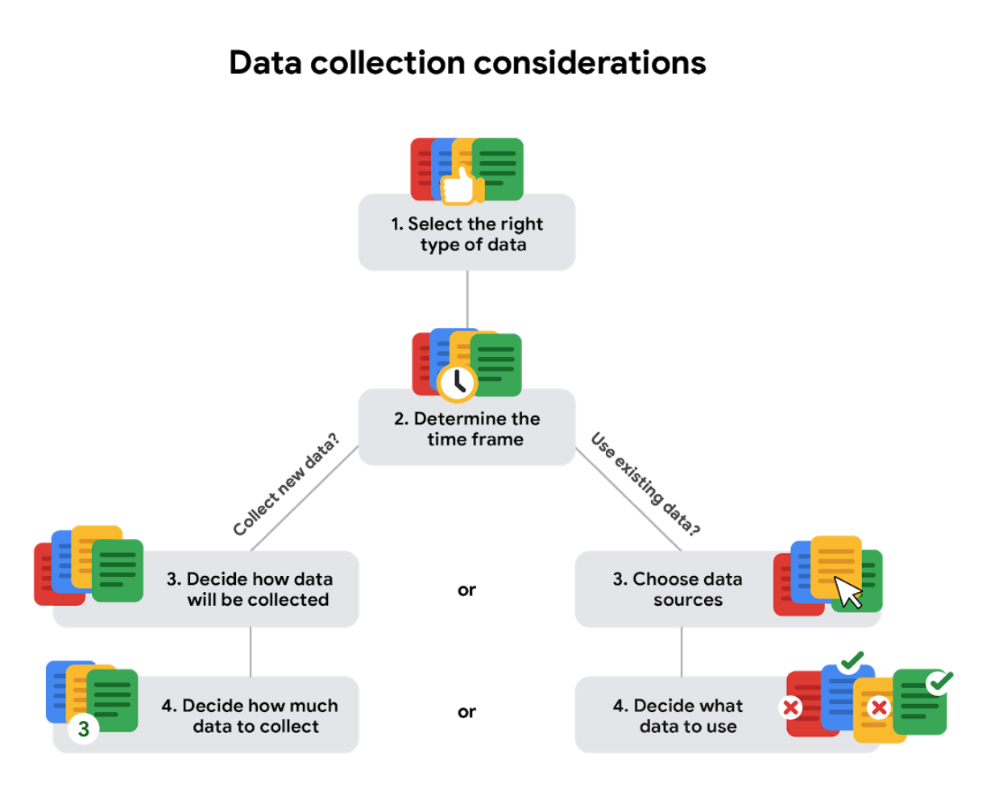

# Course 3 : Prepare Data for Exploration

This document covers the notes from the Google Data Analytics course - Course 3

## Module 1: Data types and structures

**How data is collected?**
- Interviews
- Observations
- Forms
- Questionnaire
- Surveys

**Types of data sources**
- `First-party`: Data collected directly.
- `Second-party`: Second-party data is collected directly by another group and then sold.
- `Third-party`: Third-party data is sold by a provider that didn’t collect the data themselves. Third-party data might come from a number of different sources.

**Data collection considerations**

### Data Formats

#### Primary versus secondary data

<table>
  <tr>
    <th>Data format classification</th>
    <th>Definition</th>
    <th>Examples</th>
  </tr>
  <tr>
    <td>Primary data</td>
    <td>Collected by a researcher from first-hand sources</td>
    <td>
      <ul>
        <li>Data from an interview you conducted - Data from a survey returned from 20 participants</li>
        <li>Data from questionnaires you got back from a group of workers</li>
      </ul>
    </td>
  </tr>
  <tr>
    <td>Secondary data</td>
    <td>Gathered by other people or from other research</td>
    <td>
      <ul>
        <li>Data you bought from a local data analytics firm’s customer profiles</li>
        <li>Demographic data collected by a university</li>
        <li>Census data gathered by the federal government</li>
      </ul>
    </td>
  </tr>
</table>

#### Internal versus external data

<table>
  <tr>
    <th>Data format classification</th>
    <th>Definition</th>
    <th>Examples</th>
  </tr>
  <tr>
    <td>Internal data</td>
    <td>Data that is stored inside a company’s own systems</td>
    <td>
      <ul>
        <li>Wages of employees across different business units tracked by HR</li>
        <li>Sales data by store location</li>
        <li>Product inventory levels across distribution centers</li>
      </ul>
    </td>
  </tr>
  <tr>
    <td>External data</td>
    <td>Data that is stored outside of a company or organization</td>
    <td>
      <ul>
        <li>National average wages for the various positions throughout your organization</li>
        <li>Credit reports for customers of an auto dealership</li>
      </ul>
    </td>
  </tr>
</table>

#### Continuous versus discrete data

<table>
  <tr>
    <th>Data format classification</th>
    <th>Definition</th>
    <th>Examples</th>
  </tr>
  <tr>
    <td>Continuous</td>
    <td>Data that is measured and can have almost any numeric value</td>
    <td>
      <ul>
        <li>Height of kids in third grade classes (52.5 inches, 65.7 inches)</li>
        <li>Runtime markers in a video </li>
        <li>Temperature</li>
      </ul>
    </td>
  </tr>
  <tr>
    <td>Discrete</td>
    <td>Data that is counted and has a limited number of values</td>
    <td>
      <ul>
        <li>Number of people who visit a hospital on a daily basis (10, 20, 200)</li>
        <li>Maximum capacity allowed in a room</li>
        <li>Tickets sold in the current month</li>
      </ul>
    </td>
  </tr>
</table>

#### Qualitative versus quantitative data

<table>
  <tr>
  <th>Data format classification</th>
  <th>Definition</th>
  <th>Examples</th>
  </tr>
  <tr>
    <td>Quantitative</td>
    <td>A specific and objective measure, such as a number, quantity, or range</td>
    <td>
      <ul>
        <li>Percentage of board certified doctors who are women</li>
        <li>Population size of elephants in Africa</li>
        <li>Distance from Earth to Mars at a particular time</li>
      </ul>
    </td>
  </tr>
  <tr>
    <td>Qualitative</td>
    <td>A subjective and explanatory measure of a quality or characteristic</td>
    <td>
      <ul>
        <li>Favorite exercise activity</li>
        <li>Brand with best customer service</li>
        <li>Fashion preferences of young adults</li>
      </ul>
    </td>
  </tr>
</table>

#### Nominal versus ordinal data

<table>
  <tr>
    <th>Data format classification</th>
    <th>Definition</th>
    <th>Examples</th>
  </tr>
  <tr>
    <td>Nominal</td>
    <td>A type of qualitative data that is categorized without a set order</td>
    <td>
      <ul>
        <li>First time customer, returning customer, regular customer</li>
        <li>New job applicant, existing applicant, internal applicant</li>
        <li>New listing, reduced price listing, foreclosure</li>
      </ul>
    </td>
  </tr>
  <tr>
    <td>Ordinal</td>
    <td>A type of qualitative data with a set order or scale</td>
    <td>
      <ul>
        <li>Movie ratings (number of stars: 1 star, 2 stars, 3 stars)</li>
        <li>Ranked-choice voting selections (1st, 2nd, 3rd)</li>
        <li>Satisfaction level measured in a survey (satisfied, neutral, dissatisfied)</li>
      </ul>
    </td>
  </tr>
</table>

#### Structured versus unstructured data

<table>
  <tr>
    <th>Data format classification</th>
    <th>Definition</th>
    <th>Examples</th>
  </tr>
  <tr>
    <td>Structured data</td>
    <td>Data organized in a certain format, like rows and columns</td>
    <td>
      <ul>
        <li>Expense reports</li>
        <li>Tax returns</li>
        <li>Store inventory</li>
      </ul>
    </td>
  </tr>
  <tr>
    <td>Unstructured data</td>
    <td>Data that cannot be stored as columns and rows in a relational database.</td>
    <td>
      <ul>
        <li>Social media posts</li>
        <li>Emails</li>
        <li>Videos</li>
      </ul>
    </td>

##### Comparison of Structured and Unstructured data

<table>
  <tr>
    <th>Structured data</th>
    <th>Unstructured data</th>
  </tr>
  <tr>
    <td>
      <ul>
        <li>Defined data types</li>
        <li>Most often quantitative data</li>
        <li>Easy to organize</li>
        <li>Easy to search</li>
        <li>Easy to analyze</li>
        <li>Examples: Excel, Google Sheets, SQL, customer data, phone records, transaction history</li>
      </ul>
    </td>
    <td>
      <ul>
        <li>Varied data types</li>
        <li>Most often qualitative data</li>
        <li>Difficult to search</li>
        <li>Provides more freedom for analysis</li>
        <li>Stored in data lakes, data warehouses, and NoSQL databases</li>
        <li>Can't be put in rows and columns</li>
        <li>Examples: Text messages, social media comments, phone call transcriptions, various log files, images, audio, video</li>
      </ul>
    </td>
  </tr>
</table>

### Data Modelling

- `Data modeling` is the process of creating diagrams that visually represent how data is organized and structured.
  - These visual representations are called data models.
  - Data models are similar to a blueprint of a house; different users might have different data needs, but the data model gives them an understanding of the structure as a whole. 

#### Levels of data modeling

- `Conceptual data modeling` gives a high-level view of the data structure, such as how data interacts across an organization.
  - A conceptual data model doesn't contain technical details.
  -  For example, a conceptual data model may be used to define the business requirements for a new database. 
- `Logical data modeling` focuses on the technical details of a database such as relationships, attributes, and entities.
  - For example, a logical data model defines how individual records are uniquely identified in a database. But it doesn't spell out actual names of database tables.
- `Physical data modeling` depicts how a database operates.
  - A physical data model defines all entities and attributes used.
  - For example, it includes table names, column names, and data types for the database.

#### Data-modeling techniques

- Two common methods are the `Entity Relationship Diagram (ERD)` and the `Unified Modeling Language (UML)` diagram.
  - `ERD` diagrams are a visual way to understand the relationship between entities in the data model.
  - `UML` diagrams are very detailed diagrams that describe the structure of a system by showing the system's entities, attributes, operations, and their relationships.

> [!NOTE]
> A third common data modeling technique is the `Data Dictionary`.

### Wide and Long Data Sets

- `Wide data` is a dataset in which every data subject has a single row with multiple columns to hold the values of various attributes of the subject.
  - It is helpful for comparing specific attributes across different subjects.
- `Long data` is data in which each row represents one observation per subject, so each subject will be represented by multiple rows.
  - This data format is useful for comparing changes over time or making other comparisons across subjects.

<table>
  <tr>
    <th>Wide data is preferred when</th>
    <th>Long data is preferred when</th>
  </tr>
  <tr>
    <td>Creating tables and charts with a few variables about each subject</td>
    <td>Storing a lot of variables about each subject. For example, 60 years worth of interest rates for each bank</td>
  </tr>
    <tr>
    <td>Comparing straightforward line graphs</td>
    <td>Performing advanced statistical analysis or graphing</td>
  </tr>
</table>

### Data Transformation

- `Data transformation` is the process of changing the data’s format, structure, or values.
- `Data transformation` usually involves:
  - Adding, copying, or replicating data
  - Deleting fields or records
  - Standardizing the names of variables
  - Renaming, moving, or combining columns in a database
  - Joining one set of data with another
  - Saving a file in a different format.
    - For example, saving a spreadsheet as a comma separated values (.csv) file.

#### Why transform data?

Goals for data transformation might be: 
- `Data organization`: better organized data is easier to use
- `Data compatibility`: different applications or systems can then use the same data
- `Data migration`: data with matching formats can be moved from one system to another
- `Data merging`: data with the same organization can be merged together
- `Data enhancement`: data can be displayed with more detailed fields
- `Data comparison`: apples-to-apples comparisons of the data can then be made

> [!TIP]
> Ref: [Kaggle](https://www.kaggle.com/)

### Module 1 Glossary

- `Agenda`: A list of scheduled appointments
- `Audio file`: Digitized audio storage usually in an MP3, AAC, or other compressed format
- `Boolean data`: A data type with only two possible values, usually true or false
- `Continuous data`: Data that is measured and can have almost any numeric value
- `Cookie`: A small file stored on a computer that contains information about its users
- `Data element`: A piece of information in a dataset
- `Data model`: A tool for organizing data elements and how they relate to one another
- `Digital photo`: An electronic or computer-based image usually in BMP or JPG format
- `Discrete data`: Data that is counted and has a limited number of values
- `External data`: Data that lives, and is generated, outside of an organization
- `Field`: A single piece of information from a row or column of a spreadsheet; in a data table, typically a column in the table
- `First-party data`: Data collected by an individual or group using their own resources
- `Long data`: A dataset in which each row is one time point per subject, so each subject has data in multiple rows
- `Nominal data`: A type of qualitative data that is categorized without a set order
- `Ordinal data`: Qualitative data with a set order or scale
- `Ownership`: The aspect of data ethics that presumes individuals own the raw data they provide and have primary control over its usage, processing, and sharing
- `Pixel`: In digital imaging, a small area of illumination on a display screen that, when combined with other adjacent areas, forms a digital image
- `Population`: In data analytics, all possible data values in a dataset
- `Record`: A collection of related data in a data table, usually synonymous with row
- `Sample`: In data analytics, a segment of a population that is representative of the entire population
- `Second-party data`: Data collected by a group directly from its audience and then sold
- `Social media`: Websites and applications through which users create and share content or participate in social networking
- `String data type`: A sequence of characters and punctuation that contains textual information (Refer to Text data type)
- `Structured data`: Data organized in a certain format such as rows and columns
- `Text data type`: A sequence of characters and punctuation that contains textual information (also called string data type)
- `Unstructured data`: Data that is not organized in any easily identifiable manner
- `Video file`: A collection of images, audio files, and other data usually encoded in a compressed format such as MP4, MV4, MOV, AVI, or FLV
- `Wide data`: A dataset in which every data subject has a single row with multiple columns to hold the values of various attributes of the subject

## Module 2: Data responsibility

## Module 3: Database essentials

## Module 4: Organize and protect data

## Module 5: Engage in the data community
